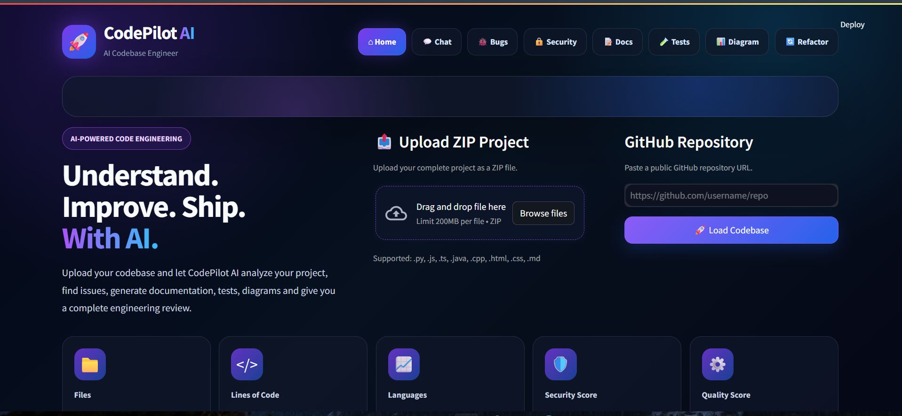
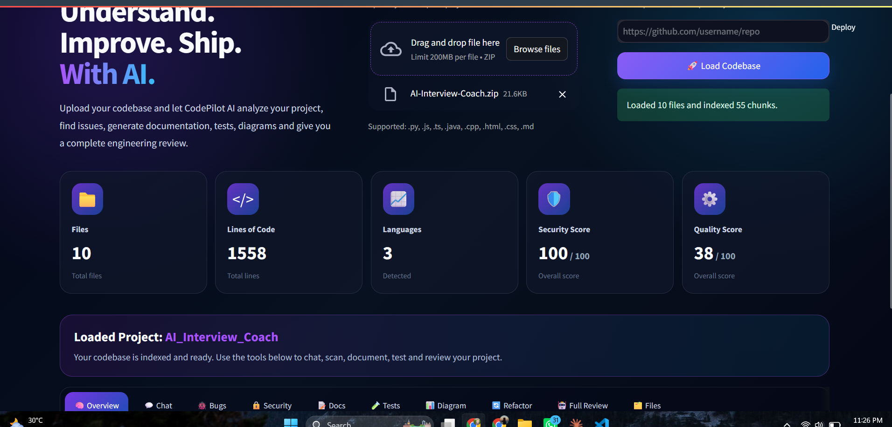
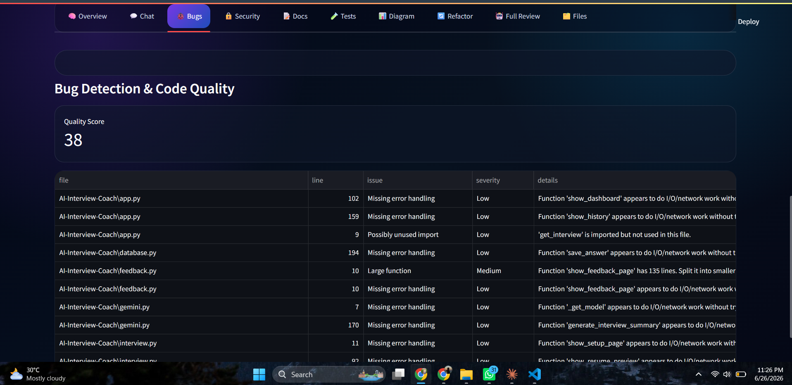
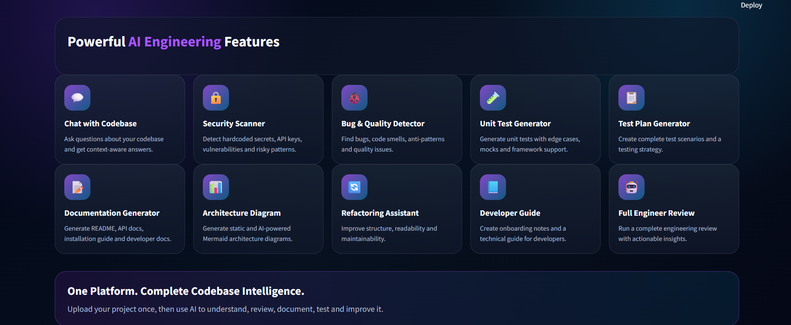

# 🚀 CodePilot AI

### AI Software Engineering Assistant powered by Generative AI, RAG, Semantic Code Search & Intelligent Code Analysis


---

# 📖 Overview

**CodePilot AI** is an intelligent AI Software Engineering Assistant designed to understand, analyze, and improve complete software projects.

Instead of answering questions about a single file, CodePilot AI builds a semantic understanding of an entire codebase. Developers can upload a ZIP project or analyze a public GitHub repository and interact with their project using natural language.

The application combines **Retrieval-Augmented Generation (RAG)**, **semantic code embeddings**, **Google Gemini**, and **static code analysis** to perform engineering tasks that normally require experienced software developers.

---

# ✨ Features

## 📂 Codebase Upload

- ZIP Projects
- Public GitHub Repositories

## 🧠 AI Codebase Understanding

- Project Purpose
- Folder Structure
- Technology Stack
- Entry Points
- Architecture Overview
- Dependency Analysis

## 💬 Chat with Codebase

Ask questions such as:

- Explain this project.
- Which file is the entry point?
- How does authentication work?
- Explain this function.
- Find security risks.
- Suggest improvements.

## 🔍 Retrieval-Augmented Generation (RAG)

- Semantic code chunking
- Vector embeddings
- ChromaDB storage
- Context retrieval
- AI-powered answers

## 🐞 Bug Detection

- Duplicate code
- Dead code
- Long functions
- Missing exception handling
- Code smells

## 🔒 Security Scanner

- Hardcoded API keys
- Passwords & tokens
- Dangerous `eval()`
- SQL injection risks
- Unsafe coding patterns

## 📝 Documentation Generator

- README generation
- Developer guide
- API documentation
- Installation guide

## 🧪 AI Test Generator

- Unit tests
- Test plans
- Edge cases
- Mock examples

Supports:

- Pytest
- Unittest
- Jest
- Mocha

## 📊 Architecture Diagram Generator

Creates Mermaid diagrams for:

- Project architecture
- Module relationships
- Folder structure
- Component flow

## 🔄 Refactoring Assistant

Provides suggestions for:

- Cleaner code
- Better naming
- Performance improvements
- Maintainability

## 🤖 Full AI Engineering Review

Generates a complete engineering report containing:

- Project overview
- Bug report
- Security report
- Architecture review
- Refactoring suggestions
- Quality metrics

## 📈 Dashboard

Displays:

- Total Files
- Lines of Code
- Languages
- Security Score
- Quality Score

---

# 🏗️ System Architecture

```text
ZIP / GitHub Repository
          │
          ▼
 Code Extraction Engine
          │
          ▼
 Source Code Parser
          │
          ▼
 Semantic Code Chunking
          │
          ▼
 Sentence Transformers
          │
          ▼
      ChromaDB
          │
          ▼
 Retrieval-Augmented Generation
          │
          ▼
    Google Gemini API
          │
          ▼
 AI Engineering Analysis
```

---

# 🛠️ Tech Stack

| Category | Technology |
|----------|------------|
| Language | Python |
| Frontend | Streamlit |
| LLM | Google Gemini |
| Retrieval | RAG |
| Vector Database | ChromaDB |
| Embeddings | Sentence Transformers |
| AI Workflow | LangGraph |
| Version Control | Git |

---

# 📂 Project Structure

```text
CodePilot-AI/
│
├── app.py
├── requirements.txt
├── README.md
├── .env.example
│
├── backend/
│   ├── analyzer.py
│   ├── bug_detector.py
│   ├── diagram_generator.py
│   ├── docs_generator.py
│   ├── github_loader.py
│   ├── langgraph_agent.py
│   ├── llm.py
│   ├── parser.py
│   ├── rag.py
│   ├── refactor.py
│   ├── report_generator.py
│   ├── security_scan.py
│   ├── test_generator.py
│   ├── vector_db.py
│   └── zip_loader.py
│
├── assets/
├── uploads/
├── chroma_db/
└── reports/
```

---

# ⚙️ Installation

## Clone Repository

```bash
git clone https://github.com/YOUR_USERNAME/CodePilot-AI.git
cd CodePilot-AI
```

## Create Virtual Environment

### Windows

```bash
python -m venv venv
venv\Scripts\activate
```

### Linux / macOS

```bash
python3 -m venv venv
source venv/bin/activate
```

## Install Dependencies

```bash
pip install -r requirements.txt
```

---

# 🔑 Configure Environment Variables

Create a `.env` file:

```env
GEMINI_API_KEY=YOUR_GEMINI_API_KEY
```

---

# ▶️ Run the Application

```bash
streamlit run app.py
```

---

# 💡 Example Use Cases

- AI Code Review
- Software Project Analysis
- GitHub Repository Understanding
- Security Auditing
- Bug Detection
- Documentation Automation
- Unit Test Generation
- Developer Onboarding

---

# 📸 Application Screenshots

## 🏠 Home



## 📂 Uploads 



## 🐞Bugs 



## 📊 Advanced Features



---

# 🚀 Future Improvements

- Multi-Agent AI Workflow
- Pull Request Review
- Docker Support
- CI/CD Integration
- VS Code Extension
- Cloud Deployment
- Team Collaboration

---

# 👩‍💻 Author

**Maham Zafar**

Software Engineering Graduate

**AI Engineer | Generative AI | Machine Learning | Python Developer**

**GitHub:** https://github.com/Maham-zafar123

**LinkedIn:** https://linkedin.com/in/maham-zafar-84695726b/

---

# ⭐ Support

If you found this project useful, consider giving it a ⭐ on GitHub.
